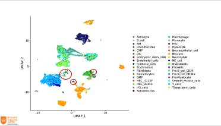

<!-- Note: this is the only page where description is overriden -->

<!-- for {{ site.variables }} see _config.yml -->
# Single cell RNA-seq data analysis with R

The general course page can be found at

[https://github.com/scgenomics/introScRNAseqDataAnalysis.github.io](https://github.com/scgenomics/introScRNAseqDataAnalysis.github.io)

## General

This two-day hands-on course will be held **{{ site.course_date }}**,
from 9:30 - 12:30 and  from 13:30 - 16:30.

## [Schedule](schedule.md)

## Computing environment

We will work with [RStudio](https://www.rstudio.com/) which provides the
[R statistical programming
environment](https://www.r-project.org/). There is no need to install
RStudio yourself.  For this course we will provide you with software
that connects to a remote RStudio server. This remote server will
contain everything you need for this course. You only have to bring your
laptop.

## Additional information

- <mailto:scgenomics@princessmaximacentrum.nl> for substantional and technical matters
- <mailto:academy@prinsesmaximacentrum.nl> for practical matters
